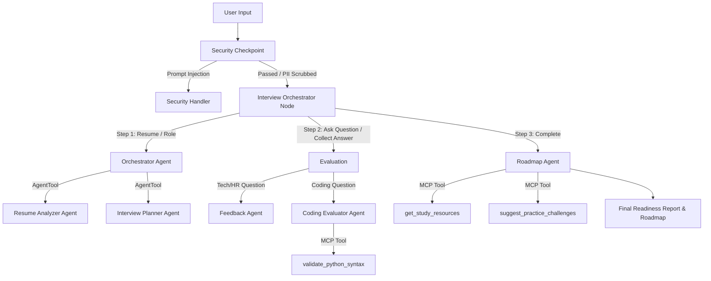

# GeminiInterviewer Submission Write-up

## Problem Statement
Job interviews can be highly stressful and require rigorous preparation. Traditional study methods (reading documentation or solving static questions) lack personalized feedback, communication coaching, and adaptive question sequencing. Candidates need an interactive, secure, and realistic simulator that can analyze their unique resumes, conduct multi-turn technical/behavioral interviews, and build tailored roadmaps for skill gaps.

## Solution Architecture

## Concepts Used & File References
*   **ADK 2.0 Workflow:** Built in [agent.py](file:///c:/Users/Public/Downloads/AI-Agents/adk-workspace/gemini-interviewer/app/agent.py#L393-L402) using graph-based function nodes (`security_checkpoint`, `interview_orchestrator`, `security_violation_handler`) and conditional routing.
*   **LlmAgent & AgentTool:** Specialized LLM agents ([agent.py](file:///c:/Users/Public/Downloads/AI-Agents/adk-workspace/gemini-interviewer/app/agent.py#L42-L136)) are auto-wrapped. The orchestrator `orchestrator_agent` delegates to `resume_analyzer` and `interview_planner` via `AgentTool` [agent.py](file:///c:/Users/Public/Downloads/AI-Agents/adk-workspace/gemini-interviewer/app/agent.py#L100).
*   **MCP Server:** Implemented in [mcp_server.py](file:///c:/Users/Public/Downloads/AI-Agents/adk-workspace/gemini-interviewer/app/mcp_server.py) using the MCP Python SDK. Wired into `coding_evaluator` and `roadmap_agent` using `McpToolset` [agent.py](file:///c:/Users/Public/Downloads/AI-Agents/adk-workspace/gemini-interviewer/app/agent.py#L103-L136).
*   **Security Checkpoint:** Implemented as a node in [agent.py](file:///c:/Users/Public/Downloads/AI-Agents/adk-workspace/gemini-interviewer/app/agent.py#L156-L203) using PII regexes, prompt injection keyword filters, and structured JSON audit logging.
*   **Agents CLI:** Managed using `agents-cli scaffold`, local playground (`make playground`), and environment settings in [pyproject.toml](file:///c:/Users/Public/Downloads/AI-Agents/adk-workspace/gemini-interviewer/pyproject.toml).

## Security Design
*   **PII Scrubbing:** Automatically redacts candidate Emails, Phone Numbers, and Social Security Numbers to `[PII_TYPE_REDACTED]` prior to sending data to the LLM. This prevents data leakage and preserves candidate privacy.
*   **Prompt Injection Detection:** Identifies injection keywords (`ignore instructions`, `jailbreak`, etc.) and immediately halts execution to prevent jailbreaking.
*   **Structured Auditing:** Logs JSON audit metadata with severity levels (`INFO`, `WARNING`, `CRITICAL`) to stdout, providing full traceability for security compliance.

## MCP Server Design
The MCP server exposes local technical validation utilities to the agents:
*   `validate_python_syntax`: Runs compilation checks on candidate-submitted python code to verify compilation status.
*   `get_study_resources`: Retrieves curated, high-quality links and tutorials from W3Schools, RealPython, and GitHub for specific technical skill gaps.
*   `suggest_practice_challenges`: Provides specific LeetCode challenge topics matching the candidate's target role and difficulty.

## Human-in-the-Loop (HITL) Flow
To simulate a live conversation, the workflow utilizes `RequestInput` at each interview question step. 
*   **Why it's needed:** The interview is inherently multi-turn. The AI poses a question, pauses execution, returns the question to the client interface, and waits until the human candidate submits their answer.
*   **Implementation:** The orchestrator yield-returns a `RequestInput` with a unique `interrupt_id` (e.g. `q_0`, `q_1`, `q_2`). Once the user responds, the graph resumes with the answer stored in `ctx.resume_inputs`.

## Demo Walkthrough
1.  **Resume Submission:** A user submits their resume and desired role. The system logs PII redaction and displays a generated 3-question plan.
2.  **Interactive Questions:** The user answers behavioral and technical questions. The `feedback_agent` provides accuracy scores and coach feedback.
3.  **Coding Evaluation:** The user writes a python function for a coding problem. The `coding_evaluator` leverages `validate_python_syntax` tool via MCP to verify syntax correctness and provides hints.
4.  **Final Report:** The `roadmap_agent` compiles all scores and uses MCP tools to construct a final report with recommended resources and practice challenges.

## Impact & Value Statement
GeminiInterviewer enables candidates to prepare for specific job descriptions and receive expert communication feedback on-demand, reducing interview anxiety and improving interview pass rates.
*   **For Candidates:** Accelerates readiness via structured, adaptive feedback.
*   **For Educators/Bootcamps:** Offers automated mock interviewing at scale without staff overhead.
